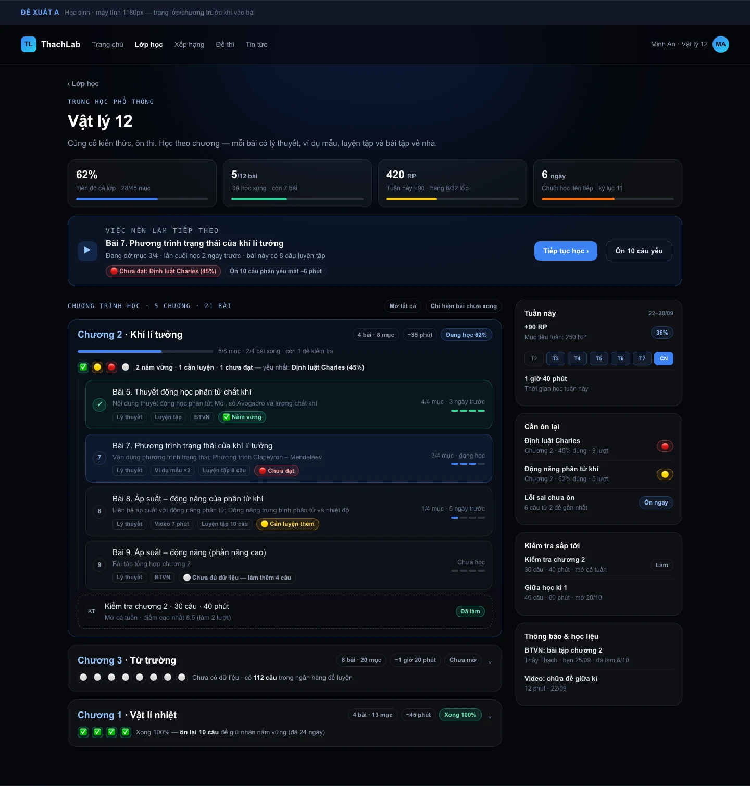
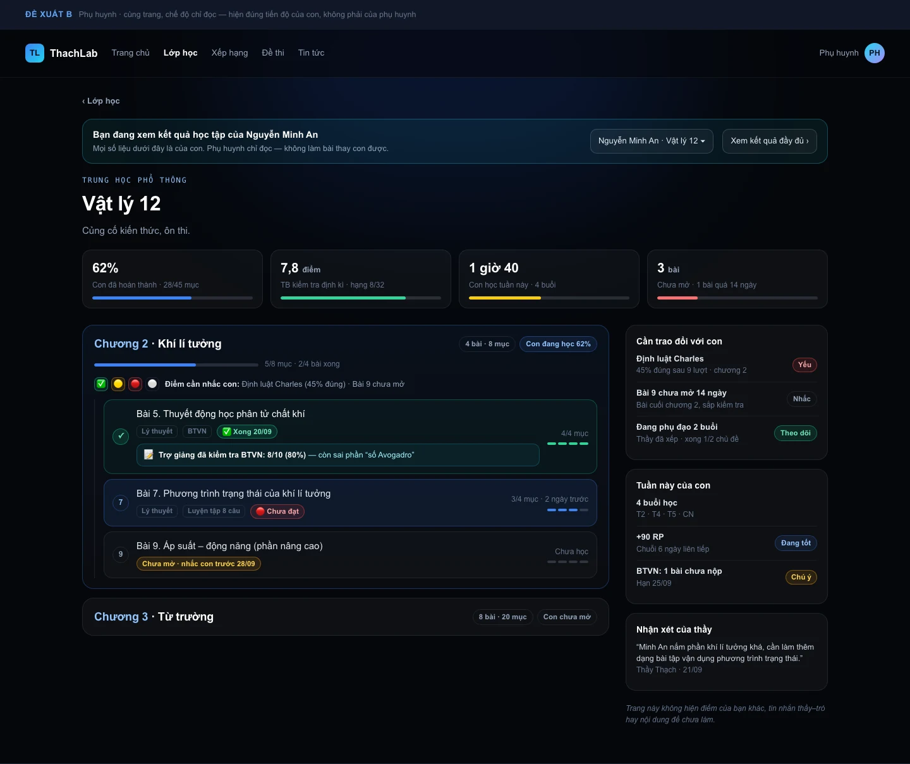
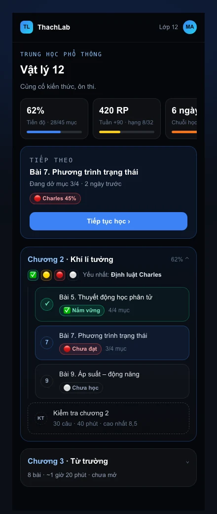

# Đề xuất — trang chương (lớp → chương → bài) · 2/10/2026

Trang đang nói tới: **`/lop-hoc/<slug>`** — trang mở từ menu **Lớp học**, liệt kê chương → bài,
bấm một bài để vào `/lop-hoc/bai`. Code: `app/lop-hoc/page.tsx` (583 dòng), CSS `.class-*` trong
`app/globals.css` (~dòng 965–1040 + nhánh sáng 1026–1039).

> Nếu ý thầy là **cây chương ở cột trái trang bài học** (`/lop-hoc/bai`, khối `.lesson-nav`) thì
> các đề xuất nhóm B/C bên dưới áp dụng gần như nguyên vẹn — trang lớp là chỗ đáng sửa trước vì
> đó là cửa vào của mọi bài.

**Trạng thái: đề xuất, chưa code.** Ảnh trong tài liệu này là **mockup** dựng lại đúng design
system hiện có (nền tối, nhấn xanh `#3b82f6`, mono eyebrow, thẻ bo 14–18px), không phải ảnh chụp
web thật.

> **Cập nhật 2/10/2026 — phần KHUNG trong tài liệu này đã bị thay.** Mockup A/B/C bên dưới dựng
> trang chương thành 1180px hai cột; nghiên cứu đồng bộ với trang bài học
> (`docs/NGHIEN-CUU-DONG-BO-TRANG-CHUONG-TRANG-BAI.md`) kết luận phải dùng đúng `.lesson-layout`:
> **272 · 1fr** (≥1024) và **272 · 1fr · 292** (≥1320), cây chương ở cột trái, rail ở `.lesson-side`.
> **Nội dung các khối (A–E) giữ nguyên; chỗ đứng đọc theo tài liệu đồng bộ.**

---

## 1. Hiện trạng (đọc code, không đoán)

Bố cục: **một cột rộng 760px** (`.lesson-main--single`), mặc định **gấp hết** mọi chương, chỉ mở
chương có `?chapter=<id>`.

| Khối | Nội dung đang có | Nguồn |
|---|---|---|
| Đầu trang | eyebrow khối lớp + `h1` tên lớp + 1 câu mô tả chung; tab môn (chỉ KHTN 9) | `classGrade`, `GRADE_DESCRIPTIONS` |
| Tiếp tục học | thẻ 1 dòng: tên bài + tên chương + %, nút "Tiếp tục" | `localStorage["thachlab-last-secondary-lesson"]` |
| Ôn lỗi sai | `MistakeReviewPanel` (lazy) | `fetchMyLatestMistakes` |
| Mỗi chương | tiêu đề `Chương N · tên`, chevron, thanh tiến độ `x/y nội dung hoàn thành` | `summarizeLessonProgress` (chỉ khi có `session`) |
| Mỗi hàng bài | số tròn, tên bài, mô tả 1 dòng, `MasteryBadge` (icon), **một** nhãn chữ: `Hoàn thành` / `Đang học · x%` / `Chưa học` / `n mục` | `lessonProgress` + `get_chapter_mastery` |
| KT giữa/cuối kì | tách khỏi chương, hàng viền nét đứt `KT`, nhãn `Đã làm`/`Chưa làm` | `isSemesterExam` |
| Dưới cùng | hạng trong lớp, "Đề thi", "Thông báo và học liệu" | `ClassRankGroups`, `fetchPublishedExams/Posts` |

**Vì sao thấy đơn điệu:** 5–6 chương × 3–8 hàng **giống hệt nhau về hình thức**; mỗi hàng chỉ có
tên + 1 nhãn chữ 12,5px màu xám; toàn bộ thông tin nằm sau một cú bấm; không có gì cho biết bài
nào dài/ngắn, có video hay không, còn thiếu mục gì, lần cuối học khi nào; bảng màu gần như chỉ có
2 trạng thái (xanh dương = đang học, xanh lá = xong) trên nền tối.

## 2. Phải sửa trước khi thêm bất cứ thứ gì (P0 — lỗi, không phải thẩm mỹ)

**(a) Phụ huynh mở trang này thấy sai hoàn toàn.** `fetchMyProgressMarks(session.user.id)`
(`app/lop-hoc/page.tsx:143`) lọc `lesson_progress` theo **user_id của chính người gọi** → phụ
huynh nhận 0 mục đã học, nên **mọi bài đều hiện "Chưa học", mọi thanh tiến độ đều 0/x**. Đúng ra
`lesson_progress` đã có policy cho phụ huynh đọc tiến độ của con:
`docs/supabase-migration-phu-huynh.sql` → `parent reads child lesson progress … is_parent_of(user_id)`
(**cần xác nhận policy này đã chạy trên production** — tài liệu ghi chạy tay bằng SQL Editor).
→ Chỉ cần: nhận ra người xem là phụ huynh, lấy `student_id` của con đang chọn, truyền id đó vào
`fetchMyProgressMarks` / `fetchLessonProgressSummaries` (hàm sau **đã nhận sẵn userId bất kỳ**).

**(b) Nhãn mastery của phụ huynh luôn rỗng.** `get_lesson_mastery` / `get_chapter_mastery` lọc
`student_id = (select auth.uid())` (`supabase/migrations/20260925160000_mastery.sql:76,81`) — hàm
tự ghi chú "muốn xem hộ học sinh khác cần tham số `p_student` riêng". Phụ huynh gọi → không có
dòng nào → không có ✅🟡🔴⚪.
→ Cần 1 RPC mới `get_chapter_mastery_of(p_student uuid, p_chapter bigint)` (bọc lại đúng công thức
cũ, tự kiểm `is_parent_of` / `teaches_student` / chính mình — theo mẫu `get_periodic_rank_of`).

**(c) Không phân biệt được đang xem với tư cách nào.** Cùng một URL, cùng một giao diện cho học
sinh, phụ huynh, khách. Phụ huynh còn thấy nút "Tiếp tục" trỏ vào bài học họ không mở được.

## 3. Đề xuất hiển thị

Ký hiệu: **[HS]** học sinh · **[PH]** phụ huynh · **[C]** cả hai.
Nguồn: **có sẵn** = dữ liệu trang đã tải, thêm chỉ tốn 0 request; **+1 RPC** = cần migration.

### A. Đầu trang — "tôi đang ở đâu" (thay vì chỉ tên lớp)

| # | Hiển thị | Cho | Nguồn |
|---|---|---|---|
| A1 | **Dải 4 ô số liệu**: % tiến độ cả lớp (28/45 mục) · bài đã xong (5/12) · RP tuần + hạng trong lớp · chuỗi ngày học | [C] | có sẵn (`summarizeLessonProgress`, `rank_my_status`/`rank_status_of`, `get_periodic_rank_of`) |
| A2 | **"Việc nên làm tiếp theo"** — một thẻ to, có lý do: bài đang dở (mục 3/4, 2 ngày trước) → nếu không có thì chương yếu nhất → nếu không thì bài kế tiếp chưa học. Kèm 2 nút: *Tiếp tục học* + *Ôn 10 câu phần yếu* | [HS] | có sẵn; thay `localStorage` bằng suy luận từ dữ liệu (máy khác vẫn đúng) |
| A3 | Ô **tìm nhanh bài/YCCĐ** trong lớp | [C] | có sẵn (mẫu `.cnc-lesson-search`) |
| A4 | **Băng nhận diện phụ huynh** + ô chọn con + link "Xem kết quả đầy đủ" | [PH] | +0 (`fetchMyChildren` đã có) |

### B. Mỗi chương thành một **thẻ chương** (đây là chỗ gỡ "đơn điệu" rõ nhất)

| # | Hiển thị | Cho | Nguồn |
|---|---|---|---|
| B1 | **Chip số liệu chương**: `4 bài · 8 mục · ~35 phút · 18 câu luyện` | [C] | thời lượng/số câu **nhồi vào `catalog.json` lúc prebuild** (`scripts/build-content.mjs`) → 0 round-trip |
| B2 | **Dải "sức khoẻ chương"**: 1 chấm/bài ✅🟡🔴⚪ + câu kết luận `2 nắm vững · 1 cần luyện · 1 chưa đạt — yếu nhất: Định luật Charles (45%)` | [C] | có sẵn (`get_chapter_mastery` đang chỉ dùng làm icon lẻ) |
| B3 | **Trạng thái chương** bằng chữ: `Đang học 62%` / `Xong 100%` / `Nên ôn lại (24 ngày)` / `Chưa mở` | [C] | có sẵn |
| B4 | Đưa **KT giữa/cuối kì vào trong chương** kèm số câu · thời gian · điểm cao nhất | [C] | có sẵn (`exam_results`) |
| B5 | Lọc nhanh: `Mở tất cả` · `Chỉ hiện bài chưa xong` | [HS] | có sẵn |

### C. Mỗi hàng bài — thêm 4 thứ, không thêm chữ rườm

| # | Hiển thị | Cho | Nguồn |
|---|---|---|---|
| C1 | **Dải chấm tiến độ theo mục** (4–6 chấm: Lý thuyết · Video · Ví dụ mẫu · Luyện tập · BTVN · Kiểm tra) — nhìn 1 giây biết còn thiếu gì | [C] | có sẵn (`progressMarks` + `itemRefs`) |
| C2 | **Chip loại nội dung**: `Video 7 phút` · `Ví dụ mẫu ×3` · `Luyện tập 8 câu` | [C] | có sẵn `lesson_items` (kiểu, số câu) |
| C3 | **Lần cuối học** (`3 ngày trước`) + **số mục x/y** | [C] | có sẵn — mở rộng `fetchMyProgressMarks` lấy thêm `done_at` (**không thêm query**) |
| C4 | **Nhãn mastery bằng chữ** thay vì chỉ icon: `✅ Nắm vững` · `🟡 Cần luyện thêm` · `🔴 Chưa đạt` · `⚪ Chưa đủ dữ liệu — làm thêm 4 câu` | [HS] (+[PH] nếu có RPC ở §2b) | có sẵn `MASTERY_LABEL` |

### D. Cột phải (rail) — hiện trang chỉ rộng 760px nên không có chỗ

| # | Hiển thị | Cho | Nguồn |
|---|---|---|---|
| D1 | **Tuần này**: RP, mục tiêu tuần (%), 7 ô chuỗi ngày, thời gian học tuần | [HS] | có sẵn (`DailyStreakCard`, `rank_*`) |
| D2 | **Cần ôn lại**: chủ đề yếu + `n câu lỗi chưa ôn` → nút mở `TopicPracticeModal` | [HS] | có sẵn (`student_outcome_gaps`, `fetchMyLatestMistakes`) |
| D3 | **Kiểm tra sắp tới** (đề mở/đóng theo lịch) | [HS] | có sẵn (`fetchPublishedExams` + `exam_open_to_student`) |
| D4 | **Thông báo & học liệu** gắn theo chương đang mở (hôm nay là 1 khối phẳng ở cuối trang) | [C] | có sẵn (`posts`) |

### E. Chế độ Phụ huynh (ảnh B)

| # | Hiển thị | Nguồn |
|---|---|---|
| E1 | 4 ô số liệu **của con**: % hoàn thành · TB kiểm tra định kì + hạng · thời gian học tuần · số bài chưa mở | `lesson_progress` (policy PH), `exam_results`, `get_periodic_rank_of` — đều **có sẵn** |
| E2 | **BTVN & trợ giảng đã chấm** ngay trong hàng bài: `Trợ giảng đã kiểm tra BTVN: 8/10 — còn sai phần "số Avogadro"` | `fetchRecentAnnouncements` + `fetchHomeworkChecks` (policy PH có sẵn, xem `components/results/ParentHomeworkNotes.tsx`) |
| E3 | **"Cần trao đổi với con"**: chủ đề yếu · bài chưa mở quá N ngày · đang phụ đạo mấy buổi | `student_outcome_gaps`, `tutoring_needs` + `tutoring_session_topics` — **policy phụ huynh đã có sẵn** (`docs/supabase-migration-phu-huynh.sql:251,255`) |
| E4 | **Nhận xét của thầy** (gần nhất) | `student_alerts` đã xử lý / ghi chú BTVN |
| E5 | Câu chốt quyền riêng tư: "không hiện điểm của bạn khác, tin nhắn thầy–trò, đề chưa làm" | tĩnh, khớp `docs/PHU-HUYNH.md` |

## 4. Nguồn dữ liệu — cái gì có sẵn, cái gì phải làm

**Không cần migration (làm được ngay):** dải số liệu A1 · thẻ chương B2–B5 · hàng bài C1–C4 ·
rail D1–D4 · phụ huynh E1 (phần tiến độ), E2, E4.

**Nhồi lúc build (`scripts/build-content.mjs` → `public/data/catalog.json`):** `itemCount`,
`videoCount`, `summaryCount`, `questionCount`, `estMinutes` cho từng bài/chương → B1, C2 **không
tốn request nào khi tải trang**. Đây là cách đúng nhất theo luật perf của repo.

**Cần migration (chỉ đọc, không đổi schema):**
1. `get_chapter_mastery_of(p_student uuid, p_chapter bigint)` — bản "xem hộ" của
   `get_chapter_mastery`, tự kiểm `p_student = auth.uid() or is_parent_of(p_student) or teaches_student(p_student)`.
   Bọc lại đúng công thức trong `20260925160000_mastery.sql`, không copy logic.
2. `get_lesson_mastery_of(p_student uuid, p_lesson bigint)` — cùng lý do, cho C4 của phụ huynh.
3. (tuỳ chọn) `get_class_chapter_progress(p_class bigint)` nếu muốn D1/A1 hiện **so với lớp** mà
   không kéo cả bảng điểm về client.

**Cần xác nhận (không phải việc code):** file `docs/supabase-migration-phu-huynh.sql` được chạy
tay bằng SQL Editor, không nằm trong `supabase/migrations/` — cần kiểm trên production rằng các
policy phụ huynh đang sống, quan trọng nhất: `lesson_progress` (§2a), `exam_results` +
`exam_question_results` (E1), `tutoring_needs` + `tutoring_session_topics` (E3). Nếu chưa chạy thì
phần phụ huynh ở tài liệu này không làm được.

## 5. Thứ tự làm đề xuất

| Ưu tiên | Việc | Ước lượng |
|---|---|---|
| **P0** | Sửa lỗi phụ huynh (§2a) + băng nhận diện A4 + dải số liệu A1 + "việc nên làm tiếp theo" A2 + dải chấm mục C1 + nhãn mastery bằng chữ C4 | 1 buổi, **không migration** |
| **P1** | Thẻ chương B2–B4 + rail D1–D4 + mở rộng bề rộng trang lên ~1180px 2 cột | 1–2 buổi, không migration |
| **P2** | `catalog.json` thêm số câu/thời lượng (B1, C2) + nút "Ôn 10 câu yếu" + gộp thông báo theo chương | 1–2 buổi, có sửa `build-content.mjs` → **phải deploy lại** |
| **P3** | 2 RPC "xem hộ" cho phụ huynh (§2b) + E3/E5 đầy đủ | cần migration, chạy ngoài giờ học sinh |

## 6. Ràng buộc kỹ thuật (theo `AGENTS.md`)

- Trang này chưa nằm trong danh sách đo Lighthouse, nhưng vẫn giữ luật: **không thêm round-trip**;
  mastery đã tải lazy theo chương mở (`ensureChapterMastery`) — giữ nguyên cơ chế đó.
- Panel mới nặng (ví dụ bảng ôn lỗi sai theo chương) phải `next/dynamic({ssr:false})` +
  `LazyErrorBoundary`.
- Ảnh mới (nếu có) dùng `.webp`; không nhúng base64.
- Mobile: rail đổi thành khối ngay dưới chương đang mở; dải số liệu **cuộn ngang**, không wrap 2 hàng.

## 7. Ba câu cần thầy chốt

1. **Phụ huynh có được mở xem nội dung bài giảng không?** Nếu giữ nguyên "không" (đúng như
   `docs/PHU-HUYNH.md` hiện nay) thì ở trang chương phải ẩn nút mở bài và chỉ hiện tiến độ; nếu
   cho xem ở chế độ chỉ đọc thì mở thêm một biến thể của trang bài học.
2. **Có cho phụ huynh thấy hạng/so sánh với lớp** (dạng ẩn danh `hạng 8/32`) hay chỉ số của con?
3. **Làm P0 ngay** hay chờ làm trọn A+B một lượt?

## Phụ lục — file đã đối chiếu

`app/lop-hoc/page.tsx` · `app/globals.css` (`.class-*`, `.lesson-shell`) ·
`services/lessons.ts` (`fetchMyProgressMarks`, `summarizeLessonProgress`, `fetchLessonProgressSummaries`) ·
`services/mastery.ts` · `services/rank.ts` · `services/content.ts` ·
`components/mastery/MasteryBadge.tsx` · `components/lessons/MistakeReviewPanel.tsx` ·
`components/results/ParentHomeworkNotes.tsx` · `app/phu-huynh/page.tsx` ·
`supabase/migrations/20260925160000_mastery.sql` · `20260925140000_perf_rls.sql` ·
`docs/supabase-migration-phu-huynh.sql` · `docs/mastery-rules.md` · `docs/PHU-HUYNH.md` ·
`docs/DATABASE-RPC.md` · `public/data/catalog.json`.
