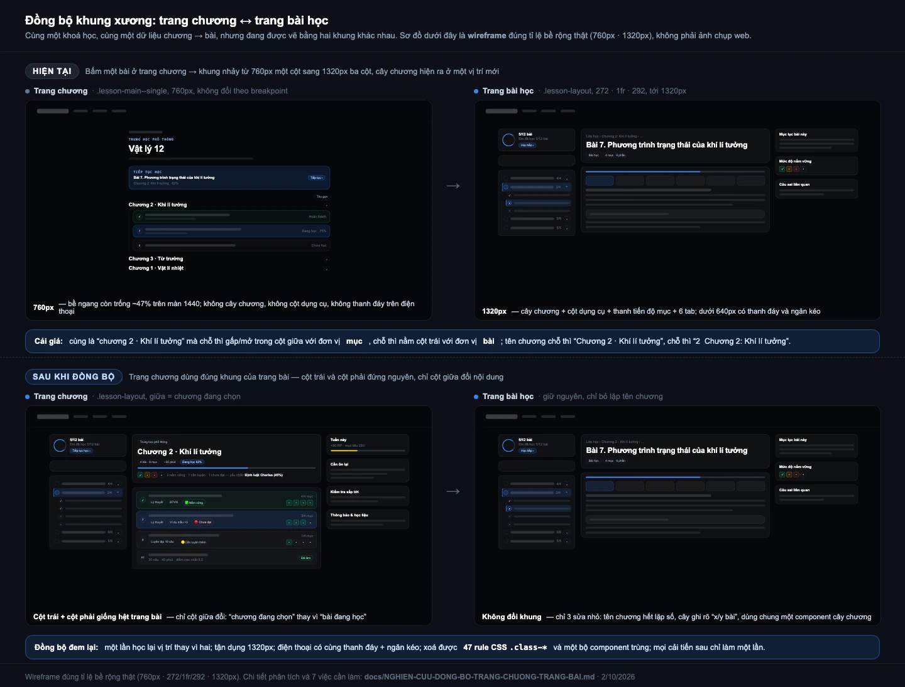

# Nghiên cứu đồng bộ — trang chương ↔ trang bài học · 2/10/2026

Phạm vi: `/lop-hoc/<slug>` (trang lớp/chương → bài, `app/lop-hoc/page.tsx`, 583 dòng) và
`/lop-hoc/bai` (trang bài học, `app/lop-hoc/bai/page.tsx`, 1 778 dòng).

## 0. Kết luận ngắn

**Chưa đồng bộ — nhưng không phải lệch ở "da", mà lệch ở "khung xương".**

Hai trang dùng chung `.lesson-shell` (cùng nền tối, cùng token nhấn `#3b82f6`, cùng font, cùng
Navbar + `pt-[76px]` + Footer), nên nhìn qua tưởng cùng một hệ. Nhưng:

| | Trang chương | Trang bài học |
|---|---|---|
| Kiểu trang | **trang đọc**: một cột 760px, không điều hướng phụ | **app shell**: 3 cột tới 1320px, cây chương dính, thanh đáy, ngăn kéo |
| Bề rộng tối đa | 760px **ở mọi breakpoint** | 860 → 1320px theo breakpoint |
| Cùng dữ liệu chương→bài | vẽ bằng `.class-chapter` / `.class-lesson` | vẽ bằng `.lesson-tree` / `.lesson-tree-chapter` |
| CSS riêng | **47 rule `.class-*`** | 513 rule `.lesson-*` (đó là bộ chuẩn) |

Cụ thể cú nhảy khi bấm một bài: đang ở **760px một cột** (giữa màn hình 1440 để trống ~47% bề
ngang), bấm bài → nhảy sang **1320px ba cột**, và một **cây chương mới toanh xuất hiện ở cột trái**
— chính là danh sách chương vừa nãy nằm trong cột giữa, nhưng đổi cả vị trí, cách gấp/mở, ký hiệu
và cách đếm. Người dùng phải định vị lại từ đầu ở mỗi lần vào/ra bài.

**Đề xuất: lấy trang bài làm chuẩn, trang chương dùng lại đúng khung của trang bài** (`.lesson-layout`
272 · 1fr · [292]) — cây chương đứng nguyên một chỗ, chỉ cột giữa đổi nội dung. Chi tiết §5.

*(Wireframe đúng tỉ lệ bề rộng thật 760px · 1320px, không phải ảnh chụp web.)*

---

## 1. Số đo khung xương (`app/globals.css`)

| Breakpoint | Trang chương | Trang bài học |
|---|---|---|
| **< 640** (điện thoại) | 1 cột, chỉ có link "‹ Lớp học". **Không** thanh đáy, **không** ngăn kéo | 1 cột + **thanh đáy 3 nút** (Mục lục · Đánh dấu đã học xong · Bài sau) + **ngăn kéo trượt từ đáy** |
| **640–1023** (tablet) | 1 cột 760px (chỉ đổi padding) | 1 cột 860px + **cây chương dính trên đầu** (`.lesson-nav` sticky, cuộn ngang) |
| **≥ 1024** | 1 cột 760px | `272px + 1fr`, rộng 1320px |
| **≥ 1320** | 1 cột 760px | `272px + 1fr + 292px` (cột dụng cụ) |

Nguồn: `.lesson-layout` (`globals.css:678`), media `1077`, `1094`, `1145`, `1155`;
`.lesson-main { max-width: 760px }` + `.lesson-main--single` (`globals.css:695-696`) dùng bởi
`app/lop-hoc/page.tsx:294`.

Tức là **trang chương không tham gia hệ breakpoint nào** — nó đứng yên ở 760px trong khi trang bài
mở rộng gấp đôi. Đây là gốc của cảm giác "đáng khác cấu trúc hơi nhiều".

## 2. Cùng một dữ liệu, hai bộ idiom

| Khía cạnh | Trang chương | Trang bài (cây chương) |
|---|---|---|
| Vỏ chương | `.class-chapter`, tiêu đề là `<button class="class-chapter-head">` | `.lesson-tree` → `<button class="lesson-tree-chapter">` |
| Số chương | chữ "Chương N" trong tiêu đề | `<em>N</em>` khoanh tròn 20px ở đầu dòng |
| Tên chương | `chapterDisplayTitle()` **bỏ tiền tố** → "Chương 1 · Vật lí nhiệt" (`page.tsx:63-67`) | `chapter.title` **nguyên bản** (`bai/page.tsx:1319`) → hiện **"1  Chương 1: Vật lí nhiệt"** — lặp số |
| Đếm trong chương | thanh tiến độ `x/y nội dung hoàn thành` (**đơn vị: mục**) | `<small>x/y</small>` (**đơn vị: bài**) — cùng hình thức, khác đơn vị |
| Bài đã xong | vòng tròn có dấu ✓ + nền xanh `is-complete` | ký tự `✓` / `○` trước tên + `.is-done` |
| Bài **đang xem** | không có khái niệm này (chỉ "Đang học x%") | `.is-current`: viền trái accent + in đậm |
| KT giữa/cuối kì | tách khỏi chương, hàng viền nét đứt nhãn `KT` | **nằm lẫn trong `ol`** như mọi bài, không nhãn |
| Tìm bài | không có | `.lesson-nav-search` "Tìm bài trong khoá" |
| Tiến độ cả khoá | không có | `.lesson-progress-summary`: vòng tròn % + `x/y bài` + nút "Học tiếp" |
| Nhãn mastery | `MasteryBadge` (icon) trên từng hàng | thẻ riêng `LessonMasteryCard` ở cột phải |
| Panel phụ (lỗi sai, hạng, thông báo) | **nhồi thẳng vào cột giữa** (`MistakeReviewPanel`, `ClassRankGroups`, "Đề thi", "Thông báo và học liệu") | đưa vào **cột phải** `.lesson-side` (`Mục lục bài này`, `Câu sai liên quan`, `Ghi chú của em`) |

CSS: `.lesson-tree*` được định nghĩa **hai lần** — bản cột trái trong `@media ≥1024`
(`globals.css:1125-1139`) và bản ngăn kéo `.lesson-drawer-body .lesson-tree*` trong `@media <640`
(`1201-1219`). Nếu trang chương giữ idiom riêng thì mọi cải tiến sau này phải làm **ba lần**.

Ghi chú nhỏ (chưa thành lỗi, nhưng cùng gốc): trang bài **sort lại** chương theo
`sort_order` rồi `id` (`bai/page.tsx:814`), trang chương thì tin vào thứ tự sẵn có của
`fetchChaptersStatic` / `fetchChapters` (cả hai đều đã `order("sort_order").order("id")` nên hiện
khớp). Gộp về một chỗ khi tách component ở §5.

## 3. Lệch về từ ngữ và chỉ dẫn

| Việc | Trang chương | Trang bài |
|---|---|---|
| Quay lại | `.lesson-back` "‹ Lớp học" | nút tròn `history.back()` **+** breadcrumb `Lớp học › Chương › Bài` (.lesson-back chỉ hiện ≥1024) |
| Nhãn "vào bài đang dở" | "Tiếp tục học" (thẻ to) | "Học tiếp" (nút nhỏ trong thẻ tiến độ) |
| Nhận diện trang | eyebrow mono "TRUNG HỌC PHỔ THÔNG" + h1 tên lớp | breadcrumb + h1 tên bài + chip meta (loại bài, số mục, hạn BTVN) |
| Nhãn trạng thái bài | `Hoàn thành` / `Đang học · x%` / `Chưa học` / `n mục` | chỉ có `✓`/`○`/`●` trong cây, không có chữ |

Hai chỗ này **đá nhau về mặt chỉ dẫn**: trang chương dạy người dùng một bộ từ ("Tiếp tục học",
"Đang học x%", đơn vị "mục"), trang bài dạy một bộ khác ("Học tiếp", dấu ○/●/✓, đơn vị "bài").

## 4. Vì sao đáng sửa (chứ không phải "mỗi trang một kiểu cũng được")

1. **Mất phương hướng ở đúng chỗ cần liền mạch nhất.** Luồng học là: chọn lớp → chọn chương → chọn
   bài → học → về. Trang chương và trang bài là hai nửa của *một* thao tác; đổi khung xương giữa
   chừng làm người học phải dò lại vị trí mỗi vòng.
2. **Bỏ phí bề ngang.** Ở 1440px, trang chương chỉ dùng 760px, phần còn lại trống — trong khi đó
   chính là chỗ để đưa thông tin "đáng xem thêm" mà đề xuất hôm trước muốn thêm.
3. **Mobile lệch hẳn.** Trang bài có thanh đáy + ngăn kéo (đã tối ưu riêng cho 375px, có ảnh trong
   `docs/anh/trang-bai-2026-10/`); trang chương tụt về danh sách trôi. Cùng một người dùng, cùng một
   khoá học, hai trải nghiệm điện thoại khác nhau.
4. **Chi phí bảo trì.** 47 rule `.class-*` + một bộ component riêng đang tồn tại chỉ để vẽ lại thứ
   `.lesson-tree` đã vẽ. Mọi thay đổi (thêm nhãn mastery bằng chữ, thêm chip số liệu…) sẽ phải sửa
   hai nơi và sẽ trôi khỏi nhau tiếp.

## 5. Đề xuất đồng bộ — 7 việc, theo thứ tự

**Nguyên tắc: trang bài là chuẩn. Trang chương không tạo idiom mới.**

1. **Trang chương dùng `.lesson-layout` thay cho `.lesson-main--single`.**
   `<aside class="lesson-nav">` bên trái = **đúng cây chương của trang bài** (`.lesson-tree`), cột
   giữa = nội dung chương đang chọn, `≥1320px` thêm `<aside class="lesson-side">` cho rail.
   Bấm một bài → cây chương **đứng nguyên toạ độ**, chỉ cột giữa thay nội dung. Đây là hạt nhân của
   việc đồng bộ; mọi thứ dưới đây chỉ là hệ quả.
2. **Trái = điều hướng cả khoá, giữa = chương đang chọn** (không phải "cả khoá ở giữa như hiện nay").
   Hiện trang chương lặp cùng một danh sách chương hai lần nếu ta thêm cây chương bên trái mà vẫn
   giữ accordion ở giữa → phải chọn một: **bỏ accordion ở giữa**, giữa là nội dung của **một** chương
   (đúng như trang bài chỉ hiện **một** bài).
3. **Cột giữa = "thẻ chương"** gồm: tiêu đề chương + chip số liệu + dải "sức khoẻ chương" + danh sách
   bài (giàu thông tin hơn: dải chấm tiến độ theo mục, chip loại nội dung, lần cuối học, nhãn mastery
   bằng chữ) + KT giữa/cuối kì trong chương. (Nội dung này lấy từ đề xuất A/B/C hôm trước.)
4. **Rail `.lesson-side` ≥1320px** dùng đúng `.lesson-panel` của trang bài: Tuần này · Cần ôn lại ·
   Kiểm tra sắp tới · Thông báo & học liệu.
5. **Mobile dùng lại `.lesson-bottombar` + `.lesson-drawer`**: 3 nút (Mục lục · *Vào bài đang dở* ·
   Chương sau) và ngăn kéo chứa cây chương + rail. Ngăn kéo đã có sẵn logic vuốt/`Esc` trong trang
   bài — nhưng **không import page đó**; tách phần dùng chung thành component.
6. **Một nguồn duy nhất cho tên chương.** Chuyển `chapterDisplayTitle()` từ `app/lop-hoc/page.tsx`
   sang `features/lessons/` (hoặc `services/lessons.ts`) và dùng cho **cả** cây chương trang bài:
   sửa luôn lỗi lặp số "1  Chương 1: Vật lí nhiệt" ở `bai/page.tsx:1319`, và breadcrumb
   `chapterTitle` (`bai/page.tsx:1599`) hiện cũng đang dùng bản nguyên "Chương 1: Vật lí nhiệt".
7. **Thống nhất đơn vị đếm và từ ngữ**: trong cây chương ghi rõ `x/y bài`; thanh tiến độ chương ghi
   `x/y mục`; chọn **một** nhãn cho hành động vào bài đang dở ("Tiếp tục học" — vì thẻ to ở trang
   chương đã dùng quen).

**Tách component dùng chung (để hai trang không trôi lại):**
`ChapterTree` (markup `.lesson-tree`, nhận `chapters`, `currentLessonId?`, `currentChapterId?`,
`mode: "pick" | "learn"`), `CourseProgressCard` (`.lesson-progress-summary`), `LessonRow` (dòng bài
giàu thông tin cho cột giữa). Đặt ở `components/lessons/`, không đụng `app/lop-hoc/bai/page.tsx`
ngoài 3 chỗ: dùng `ChapterTree`, dùng `chapterDisplayTitle`, và nhánh `.lesson-bottombar` cho trang
chương.

## 6. Cái gì **nên** giữ khác

Đồng bộ khung xương không có nghĩa hai trang giống hệt:

| | Trang chương | Trang bài |
|---|---|---|
| Mục đích | **chọn** việc để làm | **làm** việc đó |
| Cột giữa | chương đang chọn · danh sách bài + số liệu để quyết định | nội dung bài · 6 tab lý thuyết/video/bài tập… |
| Tab, thanh tiến độ mục, ghi chú, toàn màn hình | không có | có |
| Nhãn mastery | icon trên mỗi hàng (quét nhanh cả chương) | thẻ đầy đủ theo YCCĐ ở cột phải |
| Nút giữa thanh đáy mobile | "Vào bài đang dở" | "Đánh dấu đã học xong" |

## 7. Ảnh hưởng tới đề xuất hôm trước (`docs/DE-XUAT-TRANG-CHUONG-2026-10.md`)

Mockup A/B/C hôm trước dựng trang chương thành **1180px, 2 cột (nội dung + rail)**. Nay phải sửa:
**bỏ 1180px 2 cột**, thay bằng đúng `.lesson-layout` — **272 · 1fr** (≥1024) và **272 · 1fr · 292**
(≥1320). Nội dung các khối (dải định vị, thẻ chương, rail, chế độ phụ huynh) giữ nguyên; chỗ đứng
của chúng đổi: dải định vị + "Việc nên làm tiếp theo" vào cột giữa đầu chương, rail chuyển sang
`.lesson-side`. Nói cách khác: đề xuất cũ đúng về *thông tin*, sai về *khung* — bản này sửa phần khung.

## 8. Chi phí & rủi ro

- **Không thêm request Supabase nào.** Toàn bộ việc này là bố cục + tái dùng markup; cây chương
  dùng đúng dữ liệu `chapters`/`lessons` trang chương đã tải.
- **Xoá được**: ~47 rule `.class-*`, `.class-continue`, `.class-toc*` và phần lớn `app/globals.css`
  nhánh lớp; một bộ component trùng.
- **Rủi ro chính**: `app/lop-hoc/bai/page.tsx` dài 1 778 dòng và đang chạy tốt (đã qua 5 đợt tối ưu
  + sửa mobile). Vì vậy **không refactor trang bài**, chỉ: (a) tách `ChapterTree` ra khỏi nó,
  (b) dùng `chapterDisplayTitle`, (c) thêm nhánh `mode="pick"`. Ba thay đổi nhỏ, kiểm được bằng mắt.
- **Perf**: trang chương không nằm trong danh sách đo Lighthouse, nhưng luật repo vẫn áp dụng — panel
  mới nặng (`MistakeReviewPanel`, bảng xếp hạng) phải `next/dynamic({ssr:false})` +
  `LazyErrorBoundary`; **không import chunk của trang bài** sang trang chương (chỉ chia sẻ
  markup/CSS/component nhẹ).
- **Thứ tự an toàn**: (1) thống nhất tên chương + nhãn/đơn vị (§5.6–5.7) — nhỏ, kiểm ngay;
  (2) tách `ChapterTree` + cho trang chương dùng `.lesson-layout` cột trái (§5.1–5.2);
  (3) cột giữa giàu thông tin (§5.3); (4) rail (§5.4); (5) mobile thanh đáy + ngăn kéo (§5.5).

## 9. Cần thầy chốt

1. **Cây chương bên trái ở trang chương: giữ hay bỏ?** Giữ thì cột giữa thành "một chương đang chọn"
   (đồng bộ với trang bài, đỡ lặp); bỏ thì trang chương vẫn là "cả khoá một trang" như hiện nay và
   chỉ đồng bộ phần bề rộng + rail.
2. **Trang chương có dùng ngăn kéo + thanh đáy dưới 640px như trang bài không?** (Tôi đề xuất có.)
3. **Có cho đổi luôn 3 chỗ nhỏ ở trang bài** (bỏ lặp "Chương N", dùng chung `chapterDisplayTitle`,
   chuẩn hoá "x/y bài" trong cây) hay để nguyên trang bài, chỉ sửa trang chương?

## Phụ lục — file đã đối chiếu

`app/lop-hoc/page.tsx` · `app/lop-hoc/bai/page.tsx` · `app/globals.css` (`678`, `695-696`, `1077`,
`1094`, `1125-1139`, `1145`, `1155`, `1201-1219`) · `app/phu-huynh/page.tsx` ·
`components/lessons/*` · `components/mastery/LessonMasteryCard.tsx` · `services/lessons.ts` ·
`public/data/lessons/2.json` · `docs/anh/trang-bai-2026-10/` · `docs/DE-XUAT-TRANG-CHUONG-2026-10.md`.
