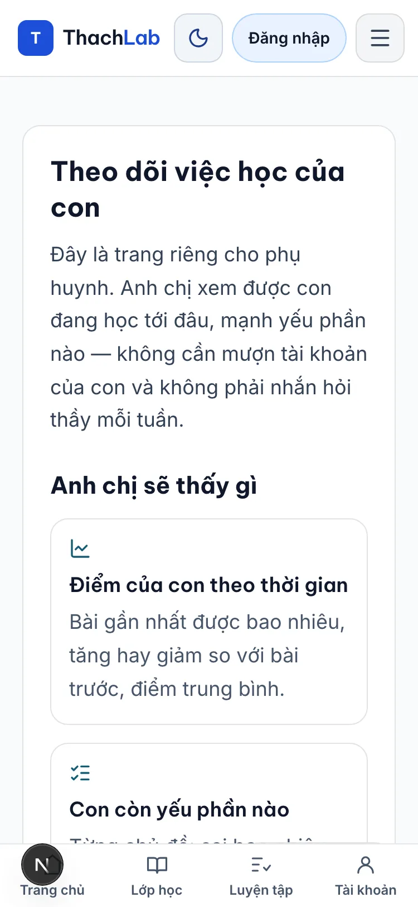
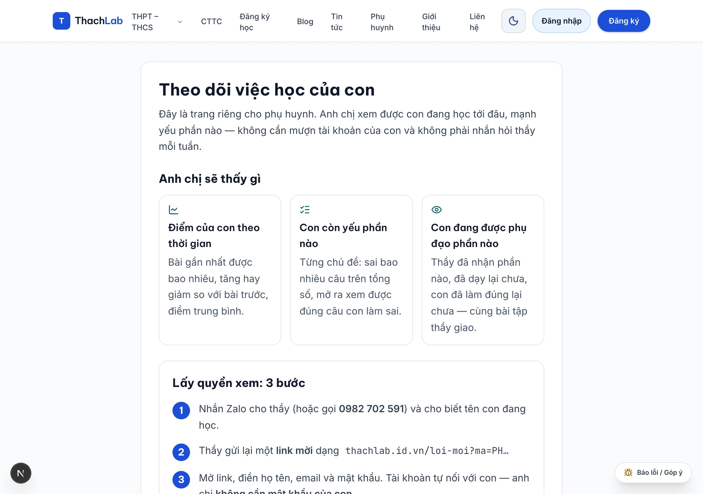
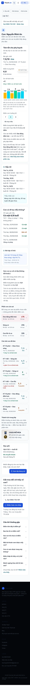
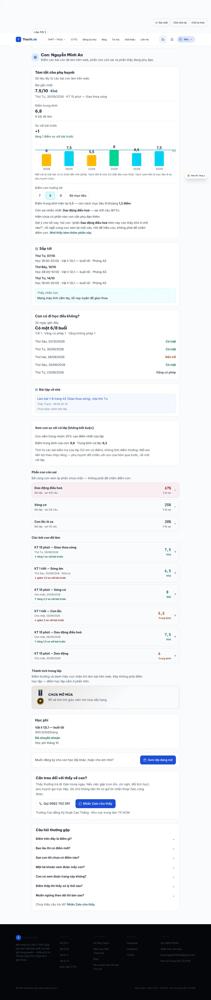
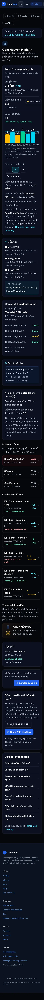

# Quy tắc thiết kế giao diện PHỤ HUYNH (45–60 tuổi)

**Đọc file này trước khi tạo/sửa bất kỳ màn hình nào phụ huynh nhìn thấy**: `/phu-huynh` (cả trạng thái
khách chưa đăng nhập), dải "Dành cho phụ huynh" ở trang chủ (`components/home/ForParents.tsx`),
`/loi-moi?ma=PH…`, `/khoa-hoc`, footer, và mọi email/tin Zalo gửi phụ huynh.

> **Bản sửa 3/10/2026 (phản biện sau đợt đầu):** bộ này ban đầu mạnh ở thị giác/công thái học nhưng gần như
> bỏ trống phần tâm lý–văn hoá của phụ huynh Việt (mọi mục văn hoá trong bản nghiên cứu đều `[CHƯA CÓ NGUỒN]`).
> Đợt sửa thêm P22–P27 và đổi P7, P15, P16, P20 — xem §9 để biết đã đổi gì, vì sao, và giả thuyết nào CHƯA kiểm
> chứng với phụ huynh thật.

Nghiên cứu nền (số đo, nguồn, mức độ tin cậy): [`docs/NGHIEN-CUU-PHU-HUYNH-45-60.md`](NGHIEN-CUU-PHU-HUYNH-45-60.md) —
26 nguồn, mọi khẳng định gắn nhãn `[ĐO]` / `[SUY LUẬN]` / `[CHƯA CÓ NGUỒN]`.

Quan hệ với bộ quy tắc học sinh [`docs/QUY-TAC-THIET-KE.md`](QUY-TAC-THIET-KE.md): **kế thừa toàn bộ**
mã `N/C/M/B/D/L` (tải nhận thức, cỡ chữ, bố cục, đích chạm, phản hồi…), nhưng **số đo đổi** ở đúng
những chỗ bảng §0 dưới đây ghi khác. Viết mã `P…` khi quy tắc chỉ đúng cho phụ huynh; viết mã học sinh
(`N3`, `B2`…) khi quy tắc là của chung. Cố ý phá quy tắc thì ghi lý do ngay trong commit.

---

## 0. Khác biệt cốt lõi so với người dùng học sinh

| Hạng mục | Học sinh 14–18 (bộ quy tắc cũ) | Phụ huynh 45–60 (bộ này) | Vì sao |
|---|---|---|---|
| Cỡ chữ thân | 16px (C1) | **18px** (P1) | WCAG coi ≥18,5px là "large text"; NN/g khuyến nghị ≥16px cho người cao tuổi; lão thị bắt đầu ~40–45 `[ĐO]` |
| Nhãn phụ | ≥13px | **≥15px** (P1) | `[SUY LUẬN]` từ cùng nguồn |
| Tương phản chữ | ≥4,5:1 (M2) | **nhắm 7:1 (AAA)**, sàn 4,5:1 (P2) | WCAG: 4,5:1 bù thị lực 20/40 = thị lực điển hình người ~80 tuổi; 7:1 bù 20/80 `[ĐO]` |
| Theme mặc định | sáng **hoặc** theo hệ thống (M1) | **luôn sáng** khi vào `/phu-huynh`, tối là tuỳ chọn (P5) | Piepenbrock 2013: positive polarity thắng ở **cả** nhóm trẻ và lớn tuổi `[ĐO]` |
| Đích chạm | ≥44px (D2) | **≥48px** cho mọi thứ bấm được (P4) | NN/g 1cm×1cm; run tay + ngón dày hơn `[ĐO]` |
| Con số | trong ngữ cảnh bài học | **số to 24px+**, tabular, một cột đọc (P6) | giảm lia mắt: Scialfa 1994 `[ĐO]` |
| Từ ngữ | "em", gamification ("mở khoá") | "anh chị / con", **không jargon** (P8) | trí tuệ kết tinh ổn định nhưng giao diện mới thì học chậm hơn `[ĐO]` |
| Đối chiếu | hạng, RP, huy hiệu (L3) | **theo ngưỡng đạt 6,5**; phần thưởng game xuống cuối + có câu giải thích (P15–P16) | loss aversion: thứ hạng tạo áp lực, ngưỡng tạo hành động `[ĐO]` |
| Kênh liên hệ | trong app | **gọi điện / Zalo là hành động hạng nhất**, có ở đầu và cuối trang (P10, P18) | Zalo 85% penetration, 16 quý dẫn đầu `[ĐO]` |
| Cỡ chữ do người dùng chỉnh | có ở trang bài | **bắt buộc có** (Dịu mắt · A− / A+) (P5) | không phó mặc cài đặt trình duyệt `[ĐO]` |

---

## 1. Nhu cầu: trang phụ huynh phải trả lời 6 câu, theo đúng thứ tự này (P7)

| # | Câu phụ huynh hỏi | Trả lời ở đâu | Trạng thái |
|---|---|---|---|
| 1 | **Con tôi học thế nào?** | Khối "Tóm tắt cho anh chị": bài gần nhất + ngày, điểm trung bình, so với bài trước, 3 bài gần nhất | ✅ có |
| 2 | **Con còn yếu phần nào?** | "Phần con còn sai": sai x/y câu, tỉ lệ sai, mở ra xem đúng câu sai | ✅ có |
| 3 | **Thầy đã làm gì cho con?** | "Phần con đang được phụ đạo" + "Bài tập về nhà" + "Bù bài" | ✅ có |
| 4 | **Con có đi học đều không?** | `ParentAttendanceCard` (RPC `parent_attendance_summary`) | ✅ code xong; ẩn tới khi chạy migration `20261003130000` |
| 5 | **Hỏi thầy bằng cách nào?** | `TeacherContact` (đầu + cuối trang) + Zalo trong câu hỏi thường gặp | ✅ có |
| 6 | **Tôi vào xem bằng cách nào?** | Trang khách: 3 bước + nút Zalo/gọi; "Đã có tài khoản? Đăng nhập" | ✅ có |

Nguyên tắc thứ tự (P7): **câu 1–2 nằm trong 1 màn hình đầu**; việc thương mại (đăng ký lớp khác, xem
thành tích game) **xuống cuối trang**.

---

## 2. Bộ quy tắc P

### P1 — Sàn cỡ chữ: thân 18px, nhãn phụ 15px, không bao giờ < 15px cho câu cần đọc
Dùng `rem` (không `px`) để A+/A− phóng được toàn bộ trang. Không dùng 12–13px cho câu cần đọc.
*Nguồn: `WCAG1.4.3`, `NNG2002`, `NNG2019`. Cài ở `app/globals.css` khối `.parent-page`.*

### P2 — Tương phản: nhắm 7:1 (AAA), sàn 4,5:1; viền/trạng thái ≥3:1
Chữ phụ dùng `#475569` trên nền trắng (7,6:1) / `#b8c4d6` trên panel tối (10,7:1); chế độ Dịu mắt dùng
`#57492f` trên kem (7,6:1). Màu nhấn/trạng thái trong khối phụ huynh ở theme sáng được đẩy lên ≥7:1
(cyan `#155e75`, emerald `#065f46`, red `#991b1b`, amber `#92400e`).
*Nguồn: WCAG 1.4.3 (7:1 bù thị lực 20/80), WCAG 1.4.11.*

### P3 — Nhịp chữ: line-height 1,65, dòng ≤ 80 ký tự, căn trái, không justify
Khối văn xuôi có `max-width: 44rem` (≈70 ký tự ở 18px). *Nguồn: WCAG 1.4.8/1.4.12.*

### P4 — Đích chạm ≥ 48×48px, cách nhau ≥ 8px
Áp cho `button`, `select`, `summary`, link dạng nút. *Nguồn: WCAG 2.5.8, NN/g touch target.*

### P5 — Mặc định nền sáng + công cụ cỡ chữ trong app
`ReadingZone` ép theme sáng ở `/phu-huynh` (không ghi đè lựa chọn đã lưu), có **Dịu mắt** và **A− / A+**;
nhãn hai nút này cũng được nâng lên 15px vì đây đúng là nút người lão thị cần bấm.
*Nguồn: Piepenbrock 2013; NN/g "người cao tuổi cần chỉnh cỡ chữ trong app".*

### P6 — Số phải to, thẳng cột, một cột đọc
Số chính 24px+ (`text-2xl`), `font-variant-numeric: tabular-nums`; **nhãn → số → câu giải thích xếp dọc**,
không dùng bảng "nhãn trái – số phải" hàng rộng (bắt mắt lia trái–phải).
*Nguồn: Scialfa 1994 (người 64 vs 24 tuổi, lệch tâm 4°–14°).*

### P7 — Một màn hình = một câu trả lời
Thứ tự: cảnh báo (nếu có) → tóm tắt → **sắp tới** → **điểm danh** → việc phải làm (bài tập/bù bài) → "xem con
so với lớp" (đóng sẵn) → phần còn sai → phụ đạo → các bài đã làm → thành tích game → **học phí** → liên hệ/FAQ. *Kế thừa N1, B2.*

### P8 — Không dùng từ nội bộ
Cấm: "mở khoá", "mastery", "RP", "chủ đề cần ôn" (mơ hồ), một mình "60%" (60% cái gì?). Dùng: "phần con
đang được phụ đạo", "sai 4/6 câu", "tỉ lệ sai". *Nguồn: NN/g heuristic #2 (ngôn ngữ của người dùng).*

### P9 — Trạng thái rỗng phải có câu giải thích + việc làm được
"Con chưa làm bài nào trên web. Khi con làm bài đầu tiên, điểm sẽ hiện ở đây — anh chị không phải làm gì
thêm." Không để ngõ cụt. *Kế thừa N3 + NN/g heuristic #3.*

### P10 — Lối liên hệ thầy có ở đầu **và** cuối trang
Thanh mảnh ở đầu (một dòng, link `tel:` + Zalo) và thẻ đầy đủ ở cuối. Phụ huynh lo lắng thì phải bấm được
ngay tại chỗ đang đọc, không đi tìm. *Nguồn: Zalo 2024 (hạ tầng niềm tin).*

### P11 — Ngày tháng viết rõ thứ
"Thứ Tư, 30/09/2026" thay vì "30/09/2026"; không dùng mốc mơ hồ ("gần đây", "vừa xong").
*Nguồn: loss aversion → cần con số + ngày tháng cụ thể `[ĐO]`.*

### P12 — Không dùng màu làm kênh thông tin duy nhất
Mọi trạng thái đều có chữ: `Đạt` / `Chưa đạt`, `↑ tăng 0,5 so với bài trước` / `↓ giảm 1,0`, `= không đổi`.
*Kế thừa M4; nguồn W3C-AGE (giảm ghi nhận ánh sáng tím).*

### P13 — Không gì tự chuyển động, không popup
Kế thừa B4. `
` gốc của trình duyệt cho FAQ: không JS, không tự mở.

### P14 — Bằng chứng thật, không hứa
Ảnh thật có chú thích nói rõ ảnh thật; số năm dạy/trường lấy từ `lib/contact.ts`; **không bịa** thành tích,
bằng cấp, cam kết thời gian phản hồi.

### P15 — Ngôn ngữ trung tính; xếp loại quen thuộc; vị trí trong lớp do phụ huynh chọn xem
Không "yếu/kém/chậm tiến bộ/đáng lo". Điểm đi kèm **xếp loại như sổ liên lạc**: Giỏi (≥8) · Khá (≥6,5) ·
Trung bình (≥5) · "Cần cố gắng thêm" (<5) — thay cho "Đạt/Chưa đạt 6,5" tự đặt (phụ huynh đã có sẵn khung này;
`lib/parent-format.ts: gradeBand`). **Không hiển thị thứ hạng cá nhân mặc định**, nhưng có mục "Xem con so với cả
lớp (không bắt buộc)" **đóng sẵn**, phụ huynh tự mở: nói bằng dải ("nhóm 25% cao nhất") + điểm trung bình lớp,
không bao giờ nói "hạng 32/40"; lớp < 8 em có điểm thì không hiện. *Đổi 3/10: bản đầu che hẳn vì suy từ loss aversion
(tái lập trên lựa chọn có rủi ro, không phải về thứ hạng), trong khi hỏi "con đứng thứ mấy" là câu rất thường gặp —
che hẳn dễ bị đọc là giấu.*
*Nguồn: Ruggeri 2020 (loss aversion tái lập 19 quốc gia) → `[SUY LUẬN]` cho VN.*

### P16 — Không so sánh anh/chị/em trong nhà; trung tính về giới
Đổi con bằng ô **"Chọn con"** (không bày số liệu hai con cạnh nhau); xưng **"phụ huynh"** (không "anh chị": phụ huynh
50–60 tuổi có thể lớn hơn thầy), không mặc định là mẹ. *Đổi 3/10.*
*Mục 4.6 của bản nghiên cứu ghi rõ: chưa có nguồn cho vai trò giới ở VN.*

### P17 — Một cột, thông tin quan trọng ở giữa cột, không cuộn ngang
Kiểm ở **320px** (WCAG 1.4.10 reflow) và **zoom 200%**. Không bảng rộng, không biểu đồ `min-w-[420px]`.
*Nguồn: Scialfa 1994 + WCAG 1.4.10.*

### P18 — Ưu tiên một chạm, hạn chế gõ
Zalo và `tel:` là nút chính; không form liên hệ. Ô nhập ≥18px để iOS không tự phóng to.
*Nguồn: Zalo 2024; NN/g heuristic #5.*

### P19 — Nói rõ số liệu này là số liệu gì
Mỗi loại số có một dòng giải thích: dưới "Tóm tắt" là "Số liệu lấy từ các bài con làm trên web"; khối
thành tích game có câu "Đây không phải điểm học tập"; FAQ có câu "Điểm trên đây là điểm gì?".
Hiểu sai nguồn điểm là mất tin, không chỉ là lỗi hiển thị.

### P20 — Biểu đồ chỉ khi nó thay được một câu chữ (và không bắt đọc trục)
Phụ huynh **không** xem biểu đồ đường có trục. Thay bằng **biểu đồ cột 6 bài gần nhất**
(`components/parent/ParentScoreBars.tsx`): số in thẳng trên đầu cột (≥18px), không trục/lưới, chỉ một vạch mốc 6,5
(và vạch mục tiêu nếu phụ huynh đặt), ngày dưới cột ≥15px, màu cột theo xếp loại + chuỗi điểm trong `aria-label`.
*Đổi 3/10: chuỗi "6,5 → 8 → 7,5" bắt phụ huynh tự so các số trong đầu — chính là tải trí nhớ làm việc mà bản
nghiên cứu muốn giảm. Cột có số không còn lý do "nhãn trục nhỏ" ở bản đầu. Chưa A/B — xem §9.* Học sinh vẫn giữ
biểu đồ SVG ở `/lop-hoc/ket-qua`.

### P21 — Đọc được trong phòng thiếu sáng
Mắt 60 tuổi cần ~3× ánh sáng so với mắt 20 tuổi (Weale 1975), nhạy chói tăng theo tuổi → tương phản cao,
nét đậm, nền sáng, không chữ mảnh/italic cho đoạn dài. *Nguồn: Weale 1975 / NIOSH, W3C-AGE.*

### P22 — Có phần "Sắp tới" nhìn về phía trước
Các khối khác đều nhìn lại. Phụ huynh cần biết buổi học tới và việc thầy nhắn con để sắp đưa đón/nhắc con
(`ParentUpcoming`: lịch tuần của khoá con đã vào + việc thầy nhắn hôm nay ≤7 ngày). **Không bịa** "bài kiểm tra
sắp tới" khi DB chưa có ngày kiểm tra.

### P23 — Điểm danh và học phí là hạng nhất, không phải "việc thương mại" xuống đáy
Với lớp học thêm, "con có đến lớp không" và "tôi đã đóng chưa" nằm trong nỗi lo đầu của người trả tiền.
`ParentAttendanceCard` (có mặt x/y buổi 30 ngày + 5 buổi gần nhất, buổi chưa điểm danh KHÔNG tính vắng) và
`ParentTuitionCard` (đọc trạng thái thầy ghi; chưa đóng nói trung tính + "nếu đã đóng, nhắn thầy cập nhật").

### P24 — Cho phụ huynh đặt mục tiêu, đo khoảng cách tới mục tiêu
Mốc "qua/chưa qua" quá thấp so với kỳ vọng nhiều gia đình. Chip 7/8/9 (`ParentGoal`), vạch mục tiêu trên biểu đồ,
câu "còn cách mục tiêu x điểm". Lưu trên điện thoại (localStorage) và **nói rõ thầy không thấy** — nếu sau này
cần thầy thấy thì phải thêm bảng + migration và hỏi lại.

### P25 — Cho phụ huynh một việc làm được, nói cách hỏi con không phán xét
Biết điểm không đủ; phụ huynh cần biết *làm gì tối nay*. Tóm tắt có câu gợi ý hỏi con đúng chủ đề còn sai nhiều
nhất ("phần … hôm nay con thấy khó ở chỗ nào?") kèm "Hỏi để hiểu con, không phải để chấm điểm con"; mục "Phần con
còn sai" mở bằng "Để cùng con xem lại — không phải để chấm điểm con". Lý do: trang này có thể thành công cụ trách
phạt trong bối cảnh áp lực thi cử; văn liệu "tiger parenting" (Kim và cs. 2013, nhớ từ kiến thức nền, chưa kiểm lại
nguồn) gợi ý kiểu kiểm soát đi cùng kết quả tâm lý kém hơn kiểu hỗ trợ.

### P26 — Đưa thông tin tới Zalo, đừng bắt đăng nhập mới biết
Đăng nhập là chỗ rớt nhiều nhất với người sợ "quê" trước công nghệ. Thẻ **"Tin Zalo cho phụ huynh"** trong hồ sơ học
sinh của thầy (`ParentDigestCard`, `lib/parent-digest.ts`) soạn sẵn bản tóm tắt từ số liệu thật (điểm + xếp loại,
chênh lệch, điểm danh, phần cần ôn, số gọi thầy); thầy sửa rồi chép/mở Zalo phụ huynh. Chưa tự gửi (cần Zalo OA/ZNS
có phí và một Edge Function) — xem §6.

### P27 — Nhãn công cụ nói bằng lời
"Chữ to hơn" / "Chữ nhỏ lại" thay cho "A+ / A−" ở trang phụ huynh (`ReadingZone plainLabels`); khuyến khích tin
nhắn thoại Zalo ở thẻ liên hệ (gõ phím chậm với tay lớn tuổi).

---

## 3. Cấu trúc trang `/phu-huynh`

### 3.1 Khách chưa đăng nhập (khách = phụ huynh đang tìm chỗ học cho con)
`app/phu-huynh/page.tsx` → `RequireAuth guestWide guestHideAuthRow` → `ParentGuestLanding`.

1. H1 "Theo dõi việc học của con" + 1 câu nói rõ lợi ích (không cần mượn tài khoản của con).
2. "Anh chị sẽ thấy gì" — 3 ô: điểm theo thời gian · con còn yếu phần nào · con đang được phụ đạo.
3. **"Lấy quyền xem: 3 bước"** — ô số 1-2-3, nút **Nhắn Zalo** (chính, ≥48px) + **Gọi 0982 702 591** +
   link "Đã có tài khoản? Đăng nhập".
4. Nói rõ quyền: chỉ đọc, không thấy điểm bạn khác, không thấy tin nhắn thầy–trò.
5. Ảnh thật kết quả học sinh (ảnh thật, có chú thích) + khối "Thầy đứng lớp" (ảnh, số năm, trường, khu vực).
6. FAQ `
` (7 câu) + lối liên hệ.

### 3.2 Đã đăng nhập
`ParentHome` → thanh liên hệ mảnh → cảnh báo/cảnh báo lớp → `StudentResultsDashboard viewer="parent"`.

| Thứ tự | Khối | Ghi chú |
|---|---|---|
| 1 | "Chọn con" + chip lớp | chỉ hiện ô chọn khi nối ≥2 con |
| 2 | Thanh liên hệ mảnh (gọi · Zalo) | P10 |
| 3 | Cảnh báo "Cần chú ý" (nếu có) | copy trung tính, không phán xét |
| 4 | **Tóm tắt cho anh chị** | bài gần nhất · điểm trung bình · so với bài trước · 3 bài gần nhất · còn sai nhiều nhất · đang phụ đạo · việc nên làm |
| 5 | Bài tập về nhà + Bù bài | chèn qua prop `afterSummary` — việc phải làm không nằm dưới cùng |
| 6 | Phần con còn sai | "sai 4/6 câu", nhãn "tỉ lệ sai", mở ra xem đúng câu sai |
| 7 | Phần con đang được phụ đạo | trạng thái + nghĩa của từng trạng thái |
| 8 | Các bài con đã làm | ngày có thứ, `Đạt/Chưa đạt`, chênh lệch so với bài trước |
| 9 | Thành tích trong lớp (game) | **xuống cuối** + câu "đây không phải điểm học tập" |
| 10 | Đăng ký học (nếu đang chờ duyệt) · Xem lớp đang mở | việc thương mại ở cuối |
| 11 | Thẻ liên hệ thầy + FAQ | P10, P19 |

> **Ba ảnh trên chụp 3/10/2026 bằng DỮ LIỆU MẪU** (con tên giả "Nguyễn Minh An", điểm/điểm danh/lịch/học phí
> do tôi bịa): chạy chính trang thật `/phu-huynh` trên bản dev, giả lập Supabase trong trình duyệt (session và
> các request `/rest/v1/*` trả dữ liệu mẫu), Chrome headless + CDP chụp trọn trang, 375px và 1280px, không cuộn
> ngang. Production chưa có phụ huynh nào nối với con (`parent_links` = 0) nên chưa có ảnh bằng dữ liệu thật —
> khi có, chụp lại và thay. Chụp lần này bắt được 2 lỗi (chữ "Thầy nhắn con" gần như vô hình ở nền sáng; nhãn
> "Mục tiêu" đè lên số trên cột) — đã sửa trước khi chụp bản cuối.

---

## 4. Đã cài vào code ở đâu

| File | Nội dung | Mã |
|---|---|---|
| `app/globals.css` (khối `.parent-page`) | sàn cỡ chữ, tương phản, đích chạm, màu nhấn ≥7:1, cỡ nút Dịu mắt | P1, P2, P4, P5, P6, P17, P18, P21 |
| `app/phu-huynh/page.tsx` | bố cục khách + đã đăng nhập, thứ tự khối, liên hệ đầu/cuối, "Chọn con", ẩn đăng ký đã duyệt | P7, P9, P10, P16, P18 |
| `components/parent/ParentGuestLanding.tsx` | trang khách 6 phần | P8, P9, P10, P14, P18 |
| `components/parent/TeacherContact.tsx` | thanh mảnh + thẻ liên hệ, số điện thoại có khoảng trắng | P10, P18 |
| `components/parent/ParentFaq.tsx` | 7 câu hỏi `
`, nói rõ nguồn điểm | P13, P19 |
| `components/results/StudentResultsDashboard.tsx` (nhánh `viewer="parent"`) | Tóm tắt, `Fact` một cột, ngày có thứ, chênh lệch có chữ, bỏ biểu đồ, hạ thành tích game, `tỉ lệ sai` | P6, P7, P8, P11, P12, P15, P19, P20 |
| `components/results/ParentHomeworkNotes.tsx` | bỏ `slate-600` (3,4:1 trên panel tối) → `slate-500` | P2 |
| `components/auth/RequireAuth.tsx` | `guestWide` (khung rộng, căn trái), `guestHideAuthRow` (trang tự đặt Zalo lên trước) | P7, P18 |
| `components/home/ForParents.tsx` | dải "Dành cho phụ huynh" ở trang chủ | P8, P18 |
| `lib/contact.ts` | nguồn duy nhất cho số điện thoại/Zalo/ảnh thầy | P14 |

---

## 5. Đo được (3/10/2026, dev server, Chrome headless qua CDP)

| Số đo | Trước | Sau |
|---|---|---|
| Cỡ chữ nhỏ nhất trong `<main>` (375px, khách) | 14px (`text-sm` cho mọi câu, kể cả danh sách) | **17,1px** (chỉ còn 1 chỗ là `<code>` 0,95em); thân **18px**, nhãn 15px |
| Số cỡ chữ trong vùng nội dung | 14 · 20 (2 cỡ, nhưng 14px cho cả câu cần đọc) | 18 · 19 · 21 · 24 (4 cỡ, sàn 18px) |
| Đích chạm (11 phần tử bấm được, 375px) | nút "Nhắn Zalo cho thầy" ~41px, chìm **dưới** ảnh 704×734 | **min 48px**, 0 phần tử < 48px |
| Cuộn ngang ở 320px | chưa đo | **không** (khách và đã đăng nhập) |
| Tương phản chữ phụ | `#64748b`/trắng = 4,76:1 (AA) | `#475569`/trắng = **7,58:1** (AAA); panel tối 10,7:1 |
| Lối liên hệ | 1 nút, nằm dưới ảnh lớn (ngoài màn đầu ở 1280) | thanh liên hệ ở đầu + thẻ ở cuối, Zalo/gọi đều ≥48px |
| Thứ tự khối | "Đăng ký học" ở đầu trang; thành tích game ở đầu kết quả | tóm tắt trước, việc thương mại và game xuống cuối |
| Request Supabase khi tải trang | n | **n** (không thêm request nào: Tóm tắt dùng đúng state đã tải ở dashboard) |

Cách đo: `scripts/check-a11y.mjs` cho từng cặp màu; Chrome headless + DevTools Protocol để đếm cỡ chữ,
đích chạm, cuộn ngang (`document.documentElement.scrollWidth` so với `innerWidth`).

---

## 6. Chưa làm — cần thầy quyết hoặc cần hạ tầng (cập nhật 3/10/2026)

| Việc | Vướng | Đề xuất |
|---|---|---|
| **Chạy migration** `20261003130000_parent_attendance_announcements.sql` | agent không được chạy lên production | `bash scripts/run-migrations.sh` — mở khoá điểm danh **và sửa lỗi cũ: phụ huynh chưa bao giờ đọc được "Bài tập về nhà"** (policy `class_announcements` chỉ cho học sinh) |
| Tự gửi tin tóm tắt tuần qua Zalo (không cần thầy bấm) | cần Zalo OA + ZNS (có phí, phải duyệt mẫu tin) và 1 Edge Function chạy theo lịch; site là export tĩnh nên không có server | hiện thầy dùng thẻ "Tin Zalo cho phụ huynh" (P26); thầy quyết có đầu tư OA không |
| Đăng nhập không mật khẩu (OTP qua SĐT/Zalo) | SMS/ZNS OTP có phí; phải cấu hình nhà cung cấp trong Supabase Auth | đo trước: bao nhiêu phụ huynh có mã nhưng chưa nhận (cột `claimed_at` ở `parent_links`) |
| Ngày kiểm tra sắp tới trong "Sắp tới" | DB chưa có ngày kiểm tra (`class_assessments` chỉ có `published_at`) | nếu muốn, thêm cột `scheduled_for` + ô chọn ngày khi giao bài |
| Mục tiêu điểm lưu cho thầy thấy | hiện chỉ trên điện thoại phụ huynh (localStorage) | bảng `parent_goals` + migration, sau khi có phản hồi phụ huynh |
| Mốc xếp loại Giỏi ≥8 / Khá ≥6,5 / TB ≥5 | thầy xác nhận khớp cách trường/lớp đang xếp loại | sửa ở `lib/parent-format.ts: gradeBand` |
| Nhận xét của thầy theo từng con | chưa có bảng; `student_alerts.handled_note` là gần nhất | nếu thầy muốn, thêm cột ghi chú ngắn theo tuần |
| Cam kết "thầy trả lời Zalo trong ngày" | hiện ghi "**thường** trả lời trong ngày" để không hứa thay thầy | thầy xác nhận thời gian thật thì sửa lại |
| Phụ huynh có biết con biết mình xem điểm không | chưa quyết: minh bạch (báo cho con) hay không | thầy quyết — ảnh hưởng niềm tin thầy–trò, đừng tự làm |
| Ảnh nghiệm thu bằng dữ liệu thật | production chưa có phụ huynh nào nối với con | khi có tài khoản + em thử, chụp lại 375/1280 và thay 3 ảnh dữ liệu mẫu ở §3.2 |
| Footer nền đen trên trang sáng | `Footer.tsx` dùng `bg-[#04060A]`, không có nhánh sáng; chữ 12px | đổi thành `bg-panel`/chữ ≥15px khi ở `/phu-huynh` (đụng file dùng chung — hỏi thầy trước) |
| **Phỏng vấn 5–8 phụ huynh thật** | chưa làm; mọi mục `[SUY LUẬN]`/`[CHƯA CÓ NGUỒN]` còn nguyên | xem §9 — câu hỏi cần kiểm |

Đã xong 3/10: `MobileTabBar` ẩn ở `/phu-huynh`.

---

## 7. Checklist trước khi báo "xong" một thay đổi UI phụ huynh

1. Chụp **375px + 1280px, sáng + tối**, cả **khách** và **đã đăng nhập** (nếu không có tài khoản phụ
   huynh thì nói rõ là ảnh dựng).
2. Đếm: **không chữ nào < 15px** trong vùng nội dung; thân ≥ 18px; ≤ 4 cỡ chữ (P1, C3).
3. Đo: mọi phần tử bấm được **≥ 48px** (P4); tương phản chữ phụ **≥ 4,5:1**, nhắm 7:1 (P2).
4. Kiểm **320px** và **zoom 200%**: không cuộn ngang (P17).
5. Đọc lại câu chữ: có từ nội bộ nào không ("mở khoá", "mastery", "RP", "%" trơ trọi)? Có câu nào phán xét
   con không? Ngày tháng có thứ chưa? (P8, P11, P15)
6. Mọi trạng thái rỗng đã có câu giải thích + việc làm được chưa? (P9)
7. Lối liên hệ thầy (gọi/Zalo) có ở **đầu và cuối** trang không? (P10)
8. Số liệu mới có dòng nói rõ nguồn không? (P19)
9. Đếm request Supabase trước/sau; mỗi request mới phải có lý do (đợt 3/10 thêm 3 — xem §9) và không chặn nội dung chính.
10. Nêu mã quy tắc (`P…`) trong mô tả commit; phá quy tắc thì ghi lý do.

---

## 8. Nguồn chính

Bản đầy đủ 26 nguồn ở [`docs/NGHIEN-CUU-PHU-HUYNH-45-60.md`](NGHIEN-CUU-PHU-HUYNH-45-60.md) §6. Năm
nguồn quyết định nhiều nhất:

- W3C WAI — WAI-AGE Literature Review: https://www.w3.org/WAI/older-users/literature/
- WCAG 2.2 — Understanding SC 1.4.3 Contrast (Minimum) (4,5:1 ↔ thị lực 20/40; 7:1 ↔ 20/80): https://www.w3.org/WAI/WCAG22/Understanding/contrast-minimum.html
- Piepenbrock, Mayr, Mund & Buchner 2013, *Ergonomics* — positive polarity có lợi cho cả người trẻ và lớn tuổi: https://pubmed.ncbi.nlm.nih.gov/23654206/
- NN/g — Middle-Aged Users' Declining Web Performance (+0,8%/năm từ 25–60 tuổi): https://www.nngroup.com/articles/middle-aged-web-users/
- Scialfa, Thomas & Joffe 1994, *Optom Vis Sci* 71(12) — tuổi tác và "useful field of view" (phân tích chuyển động mắt): https://pubmed.ncbi.nlm.nih.gov/7898880/

---

## 9. Phản biện 3/10/2026 — đã đổi gì, giả thuyết nào chưa kiểm

| Phản biện | Đã làm | Chưa kiểm chứng (cần phụ huynh thật) |
|---|---|---|
| P15 che thứ hạng đi ngược văn hoá | mục "so với cả lớp" tuỳ chọn, theo dải (P15) | phụ huynh có mở không? có hiểu "nhóm 25% cao nhất" không? |
| Mốc "đạt 6,5" lạ với phụ huynh; mục tiêu cao hơn mốc qua | xếp loại Giỏi/Khá/TB; chip mục tiêu 7/8/9 (P15, P24) | mốc có khớp trường? có ai đặt mục tiêu? |
| Trang chỉ nhìn lại | khối "Sắp tới" (P22) | phụ huynh có đọc lịch ở đây hay vẫn hỏi Zalo? |
| Điểm danh/học phí bị xếp là việc phụ | cả hai thành khối riêng (P23) | thứ tự nỗi lo thật |
| Mô hình "kéo" + đăng nhập | thẻ Tin Zalo cho phụ huynh (P26) | tỉ lệ phụ huynh thật sự dùng web sau khi nhận tin |
| P20 bỏ biểu đồ dựa trên suy luận | biểu đồ cột có số (P20) | **cột có số vs chuỗi số — chưa A/B**; thử đo thời gian trả lời "điểm lên hay xuống?" với 5 phụ huynh |
| Xưng "anh chị" sai vai | "phụ huynh" toàn bộ (P16) | cách xưng phụ huynh thấy tự nhiên nhất |
| Nhãn A−/A+ khó hiểu | "Chữ to hơn/Chữ nhỏ lại" (P27) | — |
| Trang có thể thành công cụ trách phạt con | khung "hỏi để hiểu, không chấm điểm" (P25) | tác động thật lên con — không đo được từ trang |

Mỗi khối mới thêm request Supabase: khoá học (1), điểm danh (1), việc hôm nay (1); "so với lớp" chỉ gọi khi
phụ huynh mở. Tổng trang đăng nhập: 8 → 11 request (phần phụ, không chặn nội dung chính). Ghi lại để lần tối ưu
tốc độ sau có số để so.
